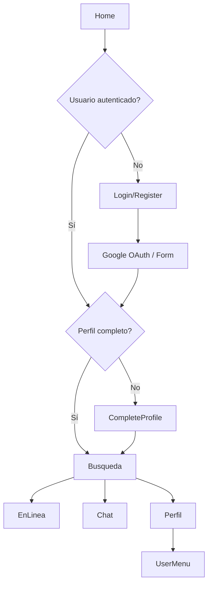

# 📂 Components - Componentes de Páginas

Esta carpeta contiene todos los componentes React específicos organizados por funcionalidad, cada uno con su respectivo archivo JSX y CSS.

## 📁 Estructura de Components

```
components/
├── 📂 Busqueda/              # Sistema de búsqueda y matches
│   ├── Busqueda.jsx          # Componente principal de búsqueda
│   └── Busqueda.css          # Estilos específicos de búsqueda
├── 📂 Chat/                  # Sistema de mensajería
│   ├── Chat.jsx              # Interfaz de chat
│   └── Chat.css              # Estilos del chat
├── 📂 CompleteProfile/       # Completar perfil de usuario
│   ├── CompleteProfile.jsx   # Formulario de perfil completo
│   └── CompleteProfile.css   # Estilos del formulario
├── 📂 EnLinea/               # Usuarios en línea
│   ├── EnLinea.jsx           # Lista de usuarios conectados
│   └── EnLinea.css           # Estilos de usuarios en línea
├── 📂 Login/                 # Autenticación
│   └── Login.jsx             # Formulario de inicio de sesión
├── 📂 Perfil/                # Perfil de usuario
│   ├── Perfil.jsx            # Vista y edición de perfil
│   └── Perfil.css            # Estilos del perfil
├── 📂 Register/              # Registro de nuevos usuarios
│   ├── Register.jsx          # Formulario de registro
│   └── Register.css          # Estilos de registro
└── 📂 UserMenu/              # Menú del usuario
    ├── UserMenu.jsx          # Menú desplegable del usuario
    └── UserMenu.css          # Estilos del menú de usuario
```

---

## 📋 Documentación por Componente

### 🔍 **Busqueda/**
**Funcionalidad**: Sistema de búsqueda y descubrimiento de usuarios compatibles.

**Características principales**:
- ✅ Filtros avanzados (edad, ubicación, intereses)
- ✅ Tarjetas de perfiles con fotos
- ✅ Sistema de "like" y "pass"
- ✅ Paginación de resultados
- ✅ Animaciones de swipe

**Estados manejados**:
- Lista de usuarios sugeridos
- Filtros activos
- Estado de carga
- Matches realizados

**Integración**:
- SearchService para obtener usuarios
- MatchController para gestionar likes
- SessionManager para usuario actual

---

### 💬 **Chat/**
**Funcionalidad**: Sistema completo de mensajería en tiempo real.

**Características principales**:
- ✅ Lista de conversaciones activas
- ✅ Interfaz de chat en tiempo real
- ✅ Envío de mensajes y archivos
- ✅ Indicadores de estado (enviado/leído)
- ✅ Notificaciones de mensajes nuevos

**Estados manejados**:
- Conversaciones del usuario
- Mensajes de conversación activa
- Estados de escritura
- Notificaciones no leídas

**Tecnologías**:
- Socket.io para tiempo real
- ChatService para gestión de mensajes
- ConversationController para conversaciones

---

### 📝 **CompleteProfile/**
**Funcionalidad**: Formulario para completar el perfil después del registro.

**Características principales**:
- ✅ Subida y crop de fotos de perfil
- ✅ Selección múltiple de intereses
- ✅ Información personal detallada
- ✅ Preferencias de búsqueda
- ✅ Validación en tiempo real

**Estados manejados**:
- Datos del formulario
- Fotos subidas
- Intereses seleccionados
- Errores de validación
- Progreso de completado

**Integración**:
- UserController para actualizar perfil
- InterestModel para obtener intereses
- Validación personalizada por campo

---

### 🟢 **EnLinea/**
**Funcionalidad**: Visualización de usuarios conectados en tiempo real.

**Características principales**:
- ✅ Lista de usuarios activos
- ✅ Estado en tiempo real
- ✅ Posibilidad de iniciar conversación
- ✅ Filtros de usuarios disponibles
- ✅ Actualizaciones automáticas

**Estados manejados**:
- Lista de usuarios en línea
- Estado de conexión propio
- Filtros aplicados
- Loading states

**Integración**:
- Socket.io para estados en tiempo real
- UserController para obtener usuarios
- SessionManager para estado propio

---

### 🔐 **Login/**
**Funcionalidad**: Autenticación de usuarios existentes.

**Características principales**:
- ✅ Login tradicional con email/contraseña
- ✅ Integración con Google OAuth
- ✅ Validación de credenciales
- ✅ Redirección automática después del login
- ✅ Manejo de errores de autenticación

**Estados manejados**:
- Datos del formulario
- Estado de loading
- Errores de validación
- Resultado de autenticación

**Integración**:
- SessionUtils para manejo de sesiones
- Google OAuth para login social
- UserController para autenticación

---

### 👤 **Perfil/**
**Funcionalidad**: Visualización y edición del perfil del usuario.

**Características principales**:
- ✅ Vista completa del perfil
- ✅ Edición inline de información
- ✅ Gestión de fotos múltiples
- ✅ Configuración de privacidad
- ✅ Historial de actividad

**Estados manejados**:
- Datos del perfil
- Modo edición/visualización
- Cambios pendientes
- Estado de guardado

**Integración**:
- UserController para CRUD del perfil
- Gestión de archivos para fotos
- MatchController para estadísticas

---

### 📋 **Register/**
**Funcionalidad**: Registro de nuevos usuarios en la plataforma.

**Características principales**:
- ✅ Formulario de registro completo
- ✅ Validación en tiempo real
- ✅ Integración con Google OAuth
- ✅ Verificación de email
- ✅ Términos y condiciones

**Estados manejados**:
- Datos del formulario
- Validaciones por campo
- Estado de registro
- Errores del servidor

**Integración**:
- RegisterController para crear usuario
- Validación de email único
- Google OAuth para registro rápido

---

### ⚙️ **UserMenu/**
**Funcionalidad**: Menú desplegable para usuarios autenticados.

**Características principales**:
- ✅ Avatar con foto de perfil o iniciales
- ✅ Menú desplegable con opciones
- ✅ Acceso rápido a funcionalidades
- ✅ Indicador de estado en línea
- ✅ Opción de cerrar sesión

**Estados manejados**:
- Estado del menú (abierto/cerrado)
- Información del usuario
- Estado de conexión

**Integración**:
- SessionManager para datos del usuario
- Logout functionality
- Navegación a otras secciones

---

## 🎨 Patrones de Diseño Utilizados

### **Estructura Común de Componentes**:
```jsx
import React, { useState, useEffect } from 'react';
import './ComponentName.css';

const ComponentName = () => {
  const [localState, setLocalState] = useState(initialState);
  
  useEffect(() => {
    // Efectos de montaje/desmontaje
  }, []);

  const handleAction = () => {
    // Lógica de manejo de eventos
  };

  return (
    <div className="component-name">
      {/* JSX del componente */}
    </div>
  );
};

export default ComponentName;
```

### **Convenciones CSS**:
- Un archivo CSS por componente
- Nomenclatura BEM para clases
- Variables CSS para valores reutilizables
- Media queries para responsive design

### **Gestión de Estado**:
- `useState` para estado local del componente
- `useEffect` para efectos secundarios y ciclo de vida
- Props para comunicación entre componentes
- SessionManager para estado global de autenticación

### **Manejo de Errores**:
- Try-catch para operaciones asíncronas
- Estados de error locales
- Feedback visual al usuario
- Logging para debugging

---

## 🔗 Flujo de Navegación



---

*Cada componente está diseñado para ser independiente, reutilizable y mantenible, siguiendo las mejores prácticas de React y CSS modular.*
