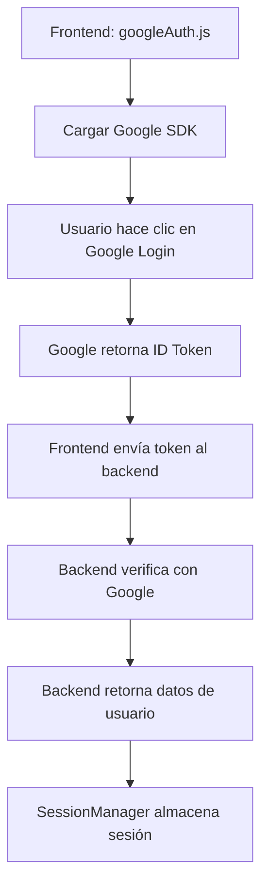

# ⚙️ Services - Servicios del Frontend

Esta carpeta contiene los servicios específicos del frontend que manejan la lógica de autenticación y comunicación con servicios externos.

## 📁 Estructura de Services

```
services/
└── 📄 googleAuth.js              # Servicio de autenticación con Google OAuth
```

## 🔐 Google Authentication Service

### **googleAuth.js**
**Descripción**: Maneja la inicialización y configuración de Google OAuth en el frontend.

#### **Funcionalidades**:
- ✅ Configuración del script de Google OAuth
- ✅ Validación del ID de cliente de Google
- ✅ Inicialización automática del SDK de Google
- ✅ Gestión de errores de configuración

#### **Código Principal**:
```javascript
import { GOOGLE_CLIENT_ID } from '../../config.js';

const initializeGoogleAuth = () => {
  // Verificar configuración
  if (!GOOGLE_CLIENT_ID) {
    console.error('ERROR: No se ha configurado el ID de cliente de Google.');
    return false;
  }

  // Cargar script de Google
  const script = document.createElement('script');
  script.src = 'https://accounts.google.com/gsi/client';
  script.async = true;
  script.defer = true;
  document.body.appendChild(script);

  return true;
};
```

#### **Uso en Componentes**:
```javascript
import initializeGoogleAuth from '../../services/googleAuth';

useEffect(() => {
  const initialized = initializeGoogleAuth();
  if (initialized) {
    console.log('Google Auth configurado correctamente');
  }
}, []);
```

## 🌐 Integración con Google OAuth 2.0

### **Configuración Requerida**:
1. **Google Cloud Console**: Proyecto configurado con OAuth 2.0
2. **Variables de entorno**: `REACT_APP_GOOGLE_CLIENT_ID`
3. **Orígenes autorizados**: `http://localhost:3000` configurado en Google Cloud

### **Flujo de Autenticación**:
1. **Inicialización**: `initializeGoogleAuth()` carga el SDK
2. **Login**: Usuario hace clic en botón de Google
3. **Token**: Google devuelve un ID token
4. **Verificación**: Backend verifica el token con Google
5. **Sesión**: SessionManager almacena la información del usuario

## 🔧 Dependencias

### **Externas**:
- **Google OAuth SDK**: Cargado dinámicamente desde Google
- **@react-oauth/google**: Componentes React para OAuth (usado en componentes)

### **Internas**:
- **config.js**: Configuración de variables de entorno
- **SessionManager**: Gestión de sesiones (backend service)
- **ApiService**: Comunicación con el backend

## 🚀 Características Técnicas

### **Carga Asíncrona**:
- Script de Google se carga de forma asíncrona
- No bloquea la carga inicial de la aplicación
- Manejo de errores si Google no está disponible

### **Validación de Configuración**:
```javascript
if (!GOOGLE_CLIENT_ID) {
  console.error('ERROR: No se ha configurado el ID de cliente de Google.');
  return false;
}
```

### **Inyección Dinámica de Script**:
```javascript
const script = document.createElement('script');
script.src = 'https://accounts.google.com/gsi/client';
script.async = true;
script.defer = true;
document.body.appendChild(script);
```

## 🔗 Conexión con Otros Servicios

### **Backend Integration**:
- **Endpoint**: `/api/auth/google` para verificar tokens
- **GoogleAuthService**: Servicio backend que verifica tokens con Google
- **UserController**: Maneja la respuesta y creación/login de usuarios

### **Frontend Components**:
- **Login.jsx**: Utiliza el botón de Google OAuth
- **App.js**: Inicializa el servicio con GoogleOAuthProvider
- **SessionManager**: Almacena el token y datos del usuario

## 📊 Flujo de Datos



## 🛡️ Seguridad

### **Validaciones**:
- ✅ Verificación de configuración antes de inicializar
- ✅ Token enviado seguramente al backend
- ✅ Backend verifica token con Google (no confianza ciega)
- ✅ Manejo de errores de red y configuración

### **Buenas Prácticas**:
- Variables de entorno para configuración sensible
- Validación del token en el backend
- No almacenamiento del token en frontend (solo en backend)
- Logs de errores para debugging

## 🔮 Posibles Extensiones

### **Futuras Mejoras**:
- **Refresh Token**: Manejo de renovación automática
- **Múltiples Providers**: Facebook, Apple, etc.
- **Biometric Auth**: Integración con WebAuthn
- **SSO**: Single Sign-On con otros servicios

### **Optimizaciones**:
- **Lazy Loading**: Cargar Google SDK solo cuando sea necesario
- **Error Recovery**: Reintentos automáticos
- **Offline Support**: Manejo cuando no hay conexión

---

*Este servicio es parte del ecosistema de autenticación de SweetMatch y trabaja en conjunto con el backend y SessionManager para proporcionar una experiencia de login fluida.*
